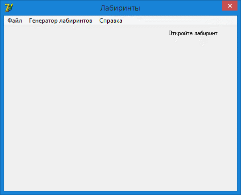
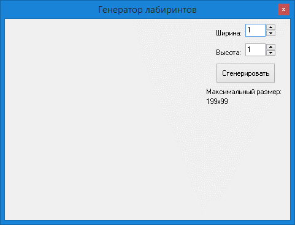
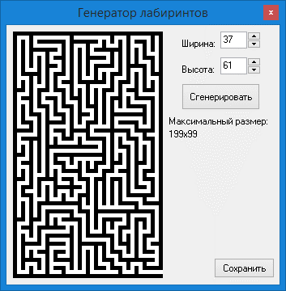
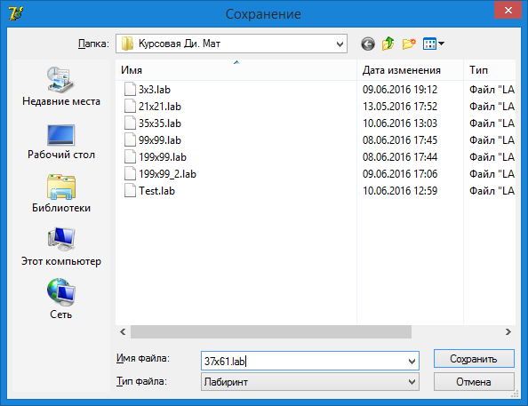
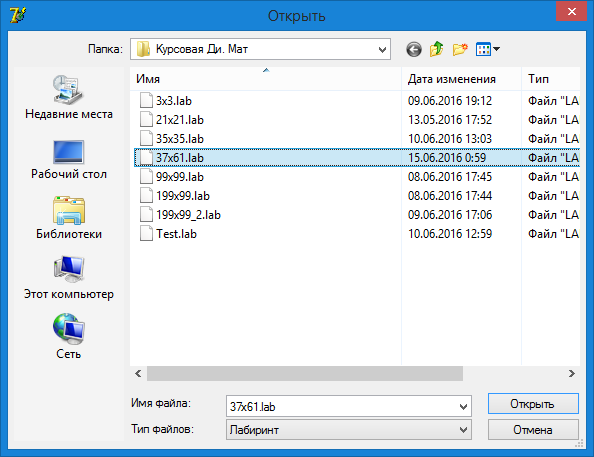
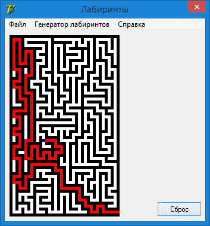

# Labyrinth
Генерация и решение лабиринта на Borland Delphi 7 на основе алгоритма Терри и алгоритма обхода графа в глубину для неориентированного связного графа

## Инструкция
1. Запустите программу    

2. Если у Вас есть файл с лабиринтом, то переходите к шагу 5, иначе нажмите на «Генератор лабиринтов»    

3. Введите ширину и высоту, нажмите кнопку «Сгенерировать» (Для примера я введу 37x61)    

4. Нажимаем кнопку «Сохранить» и сохраняем c расширением *.lab    

5. Откроем файл лабиринта для этого выбирем «Файл»->«Открыть»    

6. Выберем точку, из которой нужно найти маршрут (В моём случае я возьму точку с координатами (12;36))    

